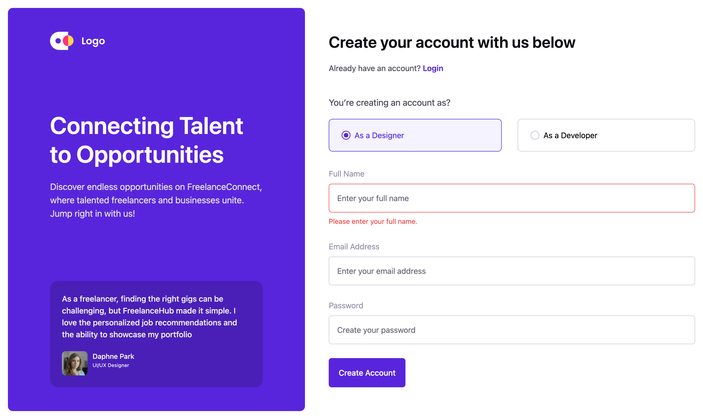

# FreelanceConnect – Tailwind CSS Registration Page

A responsive **registration page** built for FreelanceConnect using **HTML5** and **Tailwind CSS**.  
This page is the starting point for onboarding new users (freelancers or businesses) onto the platform.

---

## ✨ Features

- **Modern two-column layout**  
  Left panel with brand messaging, right panel with the signup form.
- **Responsive design**  
  Purple panel hidden on mobile (`hidden md:block`), full width form on small screens.
- **Tailwind CSS utilities**  
  Colors, spacing, borders, and typography handled entirely with Tailwind classes.
- **Accessible form markup**  
  Uses `<label>` tags, `aria-*` attributes, and error text for screen readers.
- **Role selection cards**  
  Two selectable cards (Designer / Developer) styled like radio buttons.

---

## 🗂️ Project Structure
