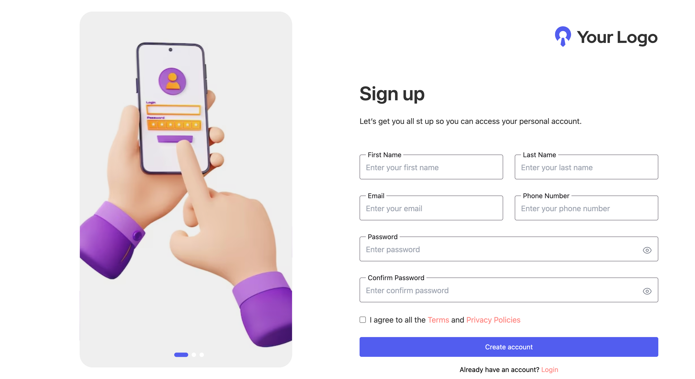
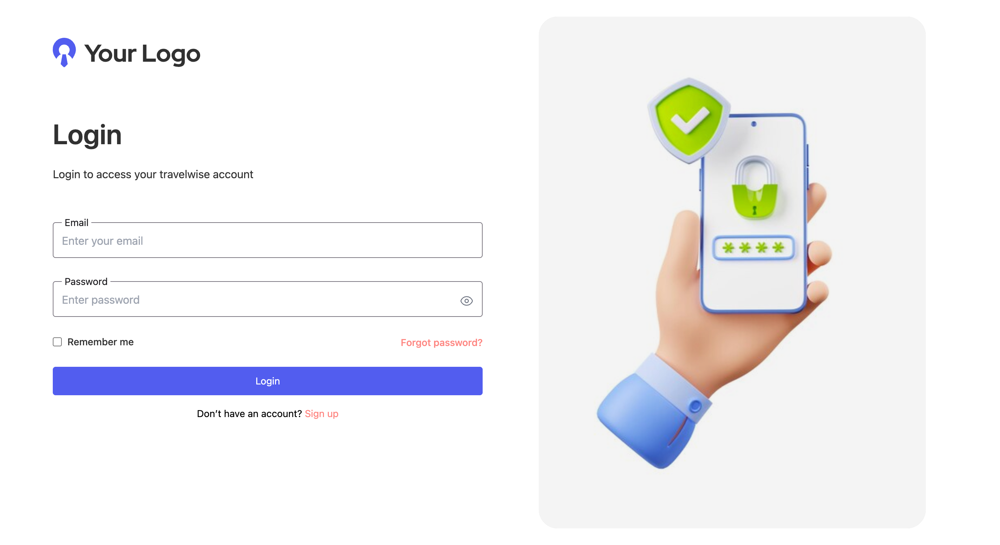
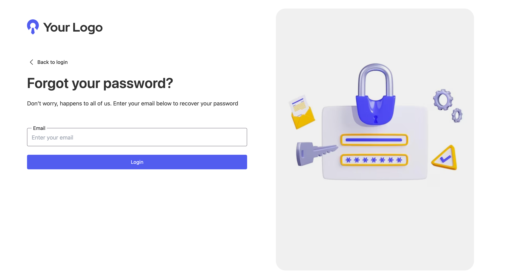
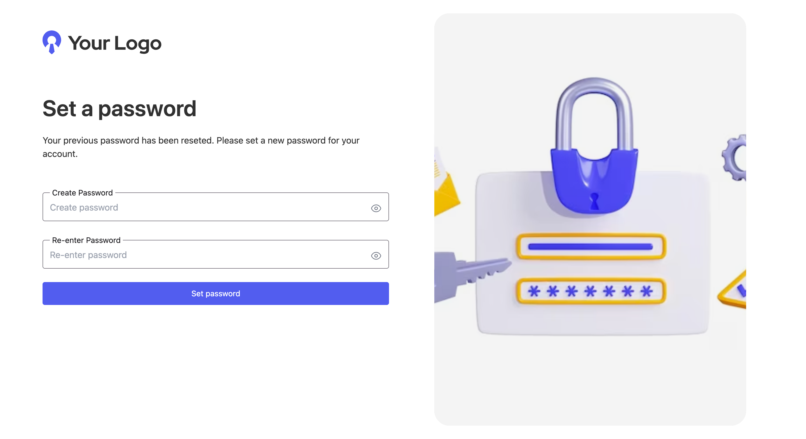

# 🌟 TailwindCSS HTML UI – Authentication Pages

A collection of **responsive authentication forms** built using **HTML + Tailwind CSS**, designed with accessibility, modern UI, and responsiveness in mind.

---

## 📸 Preview

### 🧾 Registration Page



### 🔑 Login Page



### 🔓 Forgot Password Page



### ✅ Verify Code Page


### 🔐 Set Password Page



---

## ✨ Features

### Registration Page

- 📱 **Responsive Design** – works seamlessly on mobile, tablet, and desktop.
- 🎨 **TailwindCSS** – utility-first CSS framework for modern styling.
- 🔒 **Accessible Fields** – uses `<fieldset>` + `<legend>` and ARIA attributes.
- 👁️ **Password Toggle** – eye icon to show/hide password & confirm password.
- ✅ **Form Validation Ready** – proper input types with `required` attributes.

### Login Page

- 📱 **Responsive Design** – adapts to all screen sizes.
- 🎨 **TailwindCSS** – clean, minimal, utility-first CSS.
- 🔒 **Accessible Fields** – structured with `<fieldset>` + `<legend>` and ARIA attributes.
- 👁️ **Password Visibility Toggle** – optional eye icon for password input.
- ✅ **Form Validation Ready** – `required` attributes for proper input validation.

### Forgot Password Page

- 📱 **Responsive Design** – mobile-friendly and desktop-ready.
- 🎨 **TailwindCSS** – consistent design with other authentication pages.
- 🔒 **Accessible Fields** – uses `<fieldset>` + `<legend>` and ARIA attributes.
- ✅ **Form Validation Ready** – email input with `required` attribute.
- 📧 **Simple UX** – allows users to enter their email to reset their password.

### Verify Code Page

- 📱 **Responsive Design** – works across all devices.
- 🎨 **TailwindCSS** – matches the style of other authentication pages.
- 🔢 **Code Input Fields** – designed to enter OTP or verification code.
- ✅ **Form Validation Ready** – ensures code input is entered before submission.

### Set Password Page

- 📱 **Responsive Design** – optimized for multiple screen sizes.
- 🎨 **TailwindCSS** – consistent styling with login, registration, etc.
- 🔒 **Accessible Fields** – includes password & confirm password fields.
- 👁️ **Password Toggle** – show/hide functionality for new password & confirmation.
- ✅ **Form Validation Ready** – required fields, matching passwords check (client-side or backend).

---

## 🚀 Getting Started

1. **Clone the Repository**

```bash
git clone https://github.com/bhimadev/tailwindcss-html-ui.git
```
