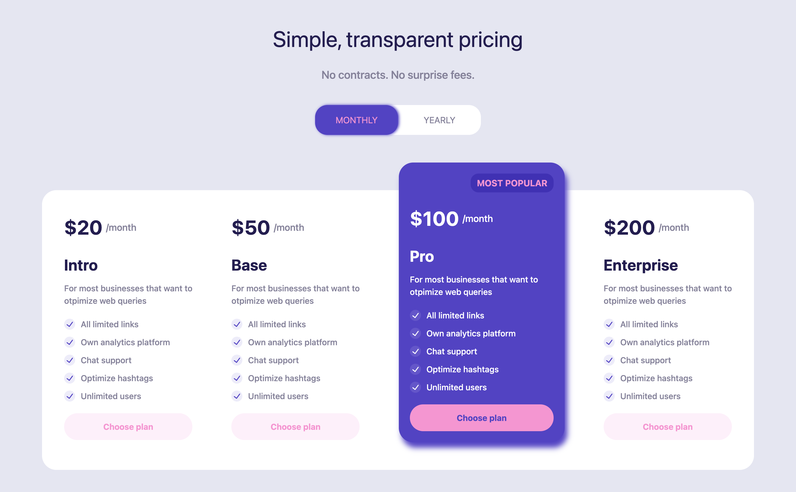

# 💰 Pricing Page – Tailwind CSS

A responsive **Pricing Section UI** built with **Tailwind CSS**.  
It includes:

- Responsive container
- Toggle tabs (Monthly / Yearly)
- 3 Pricing Cards with features
- Highlighted “Most Popular” plan

---

## 📸 Preview

---

## 🚀 Features

- **Responsive Design** – Works across all screen sizes.
- **Pricing Toggle** – Monthly and Yearly plans.
- **Three Pricing Cards** – Intro, Base, and Pro plans.
- **Highlight Section** – “Most Popular” plan styling.
- **TailwindCSS** – Built with Tailwind CDN, no build step required.

---

## 🛠️ Technologies Used

- **HTML5**
- **Tailwind CSS (via CDN)**

---
